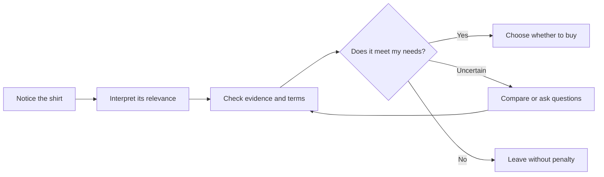

# Chapter 1: Persuasion and Human Decision-Making

[Book contents](README.md) · [Next: Brand archetypes](02-archetypes.md)

Imagine two photographs of the same plain white T-shirt. One shows it neatly folded beside a timetable. The other shows someone wearing it while exploring an unfamiliar street. The first invites you to imagine an easier morning; the second, a more adventurous afternoon. Nothing about the fabric has changed.

**Persuasion is communication that tries to influence how someone understands a choice and what they decide to do.** It shapes attention, interpretation, trust, and action. A designer might help a reader notice a size guide, understand a product, or decide that buying nothing is the sensible option.

## Influence With Room to Say No

Persuasion is not automatically manipulation. The difference involves truthfulness, transparency, and the person's freedom to choose.

| Approach | What happens | T-shirt example |
| --- | --- | --- |
| Ethical persuasion | Offers relevant reasons and leaves a meaningful choice | Shows accurate measurements and explains how to compare them with a shirt you own |
| Manipulation | Distorts information or exploits vulnerability to steer a decision | Invents customer reviews or hides extra charges until checkout |
| Coercion | Uses threats or force to constrain choice | Threatens a penalty unless someone buys the shirt |

A cheerful tone does not make a dishonest claim ethical. Nor does an emotional story automatically make it dishonest. The practical question is whether the presentation helps someone make an informed decision or undermines that ability.

## Cialdini's Principles of Influence

Robert Cialdini's framework includes seven principles. Treat them as possible influences, not buttons that control every person. The following is a concise overview based on [Cialdini's own explanation](https://www.influenceatwork.com/7-principles-of-persuasion/).

| Principle | Mechanism | Ethical use | Misuse risk |
| --- | --- | --- | --- |
| Reciprocity | Receiving encourages giving back | Offer useful help freely | Make a gift feel like debt |
| Commitment and consistency | Choices connect to earlier commitments | Support a freely chosen goal | Trap someone with a previous promise |
| Social proof | Others' behavior informs uncertainty | Show genuine, relevant reviews | Invent popularity |
| Authority | Expertise can support trust | Identify relevant qualifications | Imply expertise with costume alone |
| Liking | Affinity can increase receptiveness | Communicate warmly and respectfully | Fake friendship |
| Scarcity | Limited availability can increase appeal | Report actual stock limits | Invent a countdown |
| Unity | Shared identity can strengthen connection | Recognize a real community | Exploit belonging or exclusion |

Liking concerns affinity; unity concerns a sense of shared identity. Neither substitutes for evidence that a product fits someone's needs. A famous person wearing a shirt does not establish its quality.

## Two More Useful Lenses

### 1. Framing: Which Aspect Gets Attention?

Framing describes how the presentation of a choice affects its interpretation. Amos Tversky and Daniel Kahneman demonstrated that different descriptions of equivalent decision problems could shift preferences. That finding does not establish that every marketing rewrite will work. See their paper, [The Framing of Decisions and the Psychology of Choice](https://doi.org/10.1126/science.7455683).

For our imaginary shirt, “Start with a simple outfit” foregrounds convenience. “Make room for your own style” foregrounds expression. These are creative frames, not evidence that the shirt has new physical capabilities. Keep material information visible in either version: actual price, fit, fabric, and purchase terms.

### 2. Rhetorical Appeals: Reasons, Credibility, and Feeling

Rhetoric gives us three complementary questions: **logos** asks whether the reasons make sense; **ethos** asks why the speaker deserves trust; **pathos** concerns the audience's emotions and disposition. [Purdue OWL explains these appeals](https://owl.purdue.edu/owl/general_writing/academic_writing/establishing_arguments/rhetorical_strategies.html).

Applied to the shirt, logos might be a clear measurement comparison. Ethos might come from honestly explaining how those measurements were taken. Pathos might be a photograph that evokes a relaxed weekend. A good presentation can combine all three. Feeling should give the facts relevance, not replace them.

## A Decision Journey

This is a useful planning model, not a claim that everyone shops in this order. People skip steps, return later, or leave.

Use the journey to find missing information. If readers notice the headline but cannot find a size chart, a more dramatic headline may solve the wrong problem.

## Questions to Ask Before Trying to Persuade

- What action would benefit this audience, and why?
- Which claims can we substantiate?
- What information could change someone's decision?
- Can someone refuse, leave, or change their mind without pressure?
- Are we addressing a need or manufacturing insecurity?
- How will we judge success beyond the number of purchases?

## Try It With the White T-Shirt

Write two headlines for the identical shirt: one about simplifying a morning and one about personal expression. Under each, add the same factual product description. Ask a classmate what changed in their expectations. If they inferred a physical difference you never established, revise the presentation.

## Explore Further

**Suggestions for external research:** Search for “Cialdini unity versus liking,” “Tversky Kahneman framing 1981,” and “rhetorical appeals audience context.” Prefer original research, author explanations, and university teaching resources. Check the evidence and its limits before repeating a dramatic claim about human behavior.

## What You Should Remember

Persuasion shapes how a choice is understood. Ethical persuasion supports informed, voluntary decisions. Influence principles, framing, and rhetorical appeals help you plan a message, but they cannot guarantee a response or excuse misleading someone.
