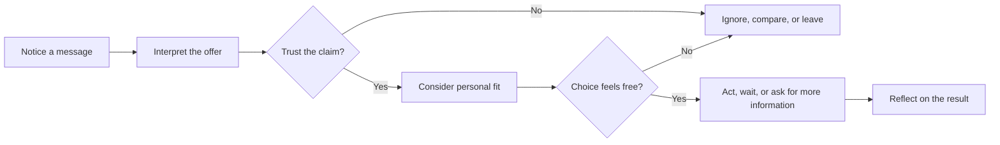

# Chapter 1: Persuasion and Human Decision-Making

Persuasion is the practice of helping shape what people notice, how they interpret it, how much they trust it, and what they decide to do. Every poster, product page, package, and interface makes choices about attention and meaning. Design does not force a decision by itself, but it can make some interpretations and actions easier to see than others.

That power makes persuasion useful and morally serious. A designer may persuade someone to try a product, understand a public message, donate to a cause, or use an interface safely. The same skills can also be used to hide costs, exploit anxiety, or pressure people into choices they would not freely make.

## Persuasion, Coercion, and Manipulation

These terms overlap, but they are not interchangeable.

| Approach | How it works | What the person can do | Main ethical question |
| --- | --- | --- | --- |
| Persuasion | Gives reasons, evidence, meaning, or useful cues that influence judgment | Freely accept, reject, compare, or delay | Is the message honest and respectful of choice? |
| Coercion | Uses threats, punishment, or force to remove meaningful alternatives | Choose under pressure or a credible threat | Is consent being replaced by fear or force? |
| Manipulation | Conceals important information or exploits a vulnerability to steer behavior | Technically choose, but with impaired understanding or unfair pressure | Would the person feel deceived if the method were revealed? |

Persuasion does not require pretending to be neutral. It does require enough honesty for the audience to make an informed judgment. For example, describing a white T-shirt as durable because it has reinforced seams can be persuasive. Calling it “the last shirt you will ever need” when it tears easily is not a creative exaggeration worth defending; it is a misleading claim.

## Six Principles of Influence

Robert Cialdini’s widely taught principles describe common patterns in social influence. They are not magic buttons, and none guarantees agreement. Their usefulness is diagnostic: they help a designer notice why a message may feel credible, urgent, familiar, or personally relevant.

1. **Reciprocity**: People often feel an obligation to return a benefit. A useful sizing guide or genuinely helpful sample may make a customer more open to a later offer. The benefit should be useful on its own, not a trap disguised as generosity.
2. **Commitment and consistency**: People tend to value consistency with choices they have already made or identities they have expressed. A person who says they want to buy fewer, longer-lasting clothes may prefer a repairable shirt. Ethical use lets people revise a decision; it does not turn a tiny click into an irreversible purchase.
3. **Social proof**: When uncertain, people often look to what others do or approve. Real customer reviews, clear numbers, or relevant community adoption can reduce uncertainty. Invented reviews, fake popularity, and selectively hidden negative evidence corrupt the signal.
4. **Liking**: People are generally more receptive to people and organizations they find familiar, attractive, relatable, or kind. A brand can communicate through a voice that fits its audience. It should not manufacture false intimacy or use personal similarity to disguise a bad deal.
5. **Authority**: Expertise, credentials, and demonstrated experience can help people judge a claim. A textile expert explaining fiber content is relevant authority for a shirt. A celebrity with no textile knowledge is not evidence of durability merely because they are famous.
6. **Scarcity**: Limited availability or time can make an option seem more valuable and can help people decide. A genuinely small production run may be worth explaining. A fake countdown timer or a permanently “almost sold out” item creates pressure instead of useful information.

Cialdini later added **unity**, the influence of a shared identity or sense of “we,” to his framework. It can make communication feel relevant when the shared identity is real and inclusive. It becomes dangerous when a designer invents an in-group and treats outsiders as less worthy.

| Principle | Mechanism | Ethical use | Misuse risk |
| --- | --- | --- | --- |
| Reciprocity | A useful benefit creates a sense of exchange | Offer help that remains valuable without a purchase | Hide a sales obligation inside a “free” gift |
| Commitment and consistency | Existing choices or identities influence later choices | Connect a decision to a clearly stated goal | Make a small step difficult to undo |
| Social proof | Other people’s behavior reduces uncertainty | Show real, relevant reviews or adoption data | Use fake reviews or selective evidence |
| Liking | Familiarity and rapport increase receptiveness | Use a voice and representative people that fit the audience | Manufacture false intimacy or similarity |
| Authority | Relevant expertise increases credibility | Identify qualified sources and explain their relevance | Borrow prestige that does not support the claim |
| Scarcity | Limited availability can increase urgency or value | State genuine limits clearly | Create fake countdowns or false shortage |
| Unity | Shared identity creates a sense of belonging | Build inclusive community around a real shared purpose | Exclude or demean people outside the chosen group |

## Two More Useful Ideas

### Framing
A frame is the angle through which information is presented. The facts may remain the same while the meaning changes. “A $25 shirt” frames price as a cost; “a shirt designed for 100 wears” frames it as a cost per use. Framing is unavoidable, so the ethical task is to make the frame informative rather than selective in a deceptive way.

The plain white T-shirt shows this clearly:

- As a **minimalist essential**, it can be shown against a clean background with practical details and a calm tone.
- As a **workwear staple**, it can be shown on someone moving through a busy day, with attention to weight, fit, and washability.
- As a **sustainable choice**, it can emphasize repair, material origins, and long use, but only if those claims are supported.
- As a **premium basic**, it can use close-up photography, careful spacing, and language about construction without changing the physical shirt.

The shirt has not changed. The selected details and surrounding story have changed, which changes what the audience notices and expects.

### Defaults and Choice Architecture
A default is the option that happens when a person does nothing. In an online shop, a preselected shipping method or newsletter checkbox can guide behavior because changing it requires extra effort. This is part of **choice architecture**: designing the conditions in which decisions happen.

Defaults can reduce friction when they are sensible and easy to change. For example, showing the shirt in the most common size range first may help shoppers begin. A default becomes ethically suspect when it benefits the designer while hiding its consequences, such as adding insurance or recurring charges without clear consent.

A related idea is the **elaboration likelihood model**: people sometimes think carefully about evidence, and sometimes use quick cues such as familiarity, appearance, or a trusted source. A high-stakes claim deserves clear evidence because an attractive layout cannot substitute for careful reasoning.

## The Decision Journey

A useful model is to imagine persuasion as a journey rather than a single button press. Attention, interpretation, trust, and action influence one another, and a person may leave at any point.

Imagine a product page for the white T-shirt. A strong photograph earns attention. A clear description helps interpretation. Accurate fabric and care details support trust. A visible return policy helps the shopper feel that the choice remains free. The final action may be buying, saving the page, asking a question, or deciding that the shirt is not right. A successful persuasion process does not have to end in a purchase.

## One Product, Several Messages

The same shirt can support different campaigns:

| Positioning | What the audience may notice | Persuasive choices | Risk to watch |
| --- | --- | --- | --- |
| Everyday essential | Ease and versatility | Outfit combinations, simple navigation, practical copy | Making ordinary quality sound exceptional without evidence |
| Long-lasting workwear | Strength and reliability | Construction details, care instructions, repair information | Implying durability without testing or a clear basis |
| Responsible purchase | Material and lifespan | Fiber information, production details, repair or reuse options | Using vague environmental language that cannot be checked |
| Premium basic | Craft and restraint | Close-up details, generous spacing, precise language | Treating visual polish as proof of superior quality |

This is why branding and design matter even when the object stays the same. They organize attention and attach expectations to a physical thing. A responsible designer keeps the underlying claims stable across the frame. The shirt should not become “ethical” merely because the photography uses natural colors, and it should not become “premium” merely because the page has more empty space.

## Ethical Cautions

Before using an influence principle, check four things:

- **Truth**: Are the claims accurate, current, and supported by evidence?
- **Disclosure**: Can the audience recognize advertising, sponsorship, scarcity, or data collection?
- **Agency**: Can people say no, change their minds, compare alternatives, and leave without punishment?
- **Proportionality**: Is the pressure appropriate to the stakes? A reminder about a T-shirt is different from pressure around health, finances, housing, or safety.

Pay particular attention to children, people in crisis, people with limited language or digital access, and anyone whose vulnerability is visible to the designer but not easily visible to them. “It works” is not a complete ethical defense. The method and the consequences matter too.

## Questions to Ask Before Trying to Persuade

1. What decision am I asking someone to make, and why does it matter?
2. What do they need to know to make that decision responsibly?
3. Which parts of my message are facts, and which are interpretation or mood?
4. Am I using a real benefit, or manufacturing pressure through fear, shame, or confusion?
5. Can the person compare alternatives and decline without friction or penalty?
6. Would I be comfortable explaining this design choice to the audience after they acted?
7. Who might be disadvantaged by this message, default, interface, or assumption?
8. For the white T-shirt, what has actually changed: the product, the evidence, or only the frame?

## Explore Further

If you want to research this chapter, search for:

- Robert Cialdini six principles of influence and unity principle
- framing effects in behavioral economics
- choice architecture and ethical defaults
- elaboration likelihood model and persuasion
- dark patterns and deceptive design
- informed consent and persuasive technology

Use university libraries, textbooks, and reputable professional or academic sources. Check the date, author, evidence, and context before relying on a result.

## What You Should Remember

Persuasion shapes attention, interpretation, trust, and action. It is different from coercion because it preserves meaningful choice, and different from manipulation because it does not depend on deception or hidden exploitation. Cialdini’s principles, framing, defaults, and careful attention to how people process information can help designers understand influence. The same white T-shirt can mean several things through different presentation choices, but ethical design keeps the claims truthful and the audience’s agency intact.
