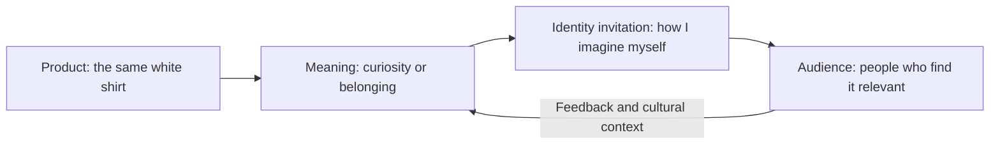

# Chapter 2: Brand Archetypes and Meaning

[Book contents](README.md) · [Next: Design language](03-design-language.md)

Chapter 1 asked how a message influences a decision. Now ask what the decision means to the person making it. Someone might choose a white T-shirt because it feels practical, independent, welcoming, or creatively open. The shirt is an object; the brand offers a story around it.

**A brand archetype is a recurring cultural or narrative pattern used to organize a brand's meaning.** It can guide tone, imagery, and the role a brand hopes to play. It is a planning framework, not a diagnosis of a customer's personality.

The central question is: **What does the audience get to feel, imagine, or become by choosing this brand?** The answer is an invitation, never a guaranteed transformation.

## A Vocabulary for Meaning

The twelve labels below are common in branding discussions. Names vary between applications; Carol S. Pearson discusses this variation in her [account of the 12-archetype system](https://carolspearson.com/about/the-pearson-12-archetype-system-human-development-and-evolution). Here, the shirt directions are invented exercises, not claims about existing brands.

| Archetype | Central invitation | Possible shirt direction | Watch out for |
| --- | --- | --- | --- |
| Explorer | Independence | An unfamiliar street | Recklessness |
| Sage | Understanding | A clear comparison | Superiority |
| Creator | Originality | A styling experiment | Creative pressure |
| Ruler | Order | A considered wardrobe | Elitism |
| Caregiver | Care | An attentive routine | Guilt |
| Rebel | Defiance | An anti-logo statement | Empty provocation |
| Hero | Courage | Preparation for practice | Shame |
| Everyperson | Belonging | Everyday company | Forced sameness |
| Innocent | Optimism | An uncomplicated morning | Denial |
| Jester | Play | A visual joke | Ridicule |
| Lover | Connection | A thoughtful detail | Exclusion |
| Magician | Transformation | An outfit reveal | Impossible promises |

You do not need all twelve in a project. Choosing a main direction gives you a reason to accept one headline and reject another. A Sage presentation should make understanding easier; simply calling something “intelligent” does little work.

## One Shirt, Four Invitations

The physical shirt stays identical in these imagined presentations. Only the message and its surroundings change.

| Direction | Original sample headline | Presentation | Meaning offered |
| --- | --- | --- | --- |
| Explorer | Take the unfamiliar turn. | Someone browsing a street market, with generous space around the photograph | Permission to be curious |
| Sage | Start with the details. | An ordinary product photograph beside clearly organized measurements | Confidence through understanding |
| Creator | Your outfit starts here. | The shirt paired with different accessories on a studio table | A starting point for self-expression |
| Everyperson | A place in your everyday. | Friends spending an unremarkable afternoon together | Familiarity without performance |

Notice that Explorer does not require a mountain expedition. An unfamiliar neighborhood can communicate curiosity without implying that the shirt is technical outdoor equipment. Creator does not require printing on the shirt, either: styling can supply the creative activity while the product remains unchanged.

The last arrow matters. Audiences interpret a brand; designers do not get to assign meaning unilaterally.

## Archetypes Are Not Destiny

A person can want adventure on Saturday and predictability on Monday. A brand can combine tendencies, too. Explorer and Sage might support a travel guide that pairs curiosity with reliable information. That does not mean every combination is equally coherent: a page promising both effortless relaxation and relentless achievement needs a clear priority.

Cultural context also changes interpretation. A pose intended to suggest independence may read as isolation. A visual symbol intended to suggest care may carry an unfamiliar or unwanted association. Ask people in the intended audience what they see instead of treating your own interpretation as universal.

Archetypes are models, not literal personality diagnoses, scientific customer segments, or rules about gender, class, or nationality. Describe a relevant situation—“someone choosing an outfit for a casual day”—before inventing a fixed customer type.

## From Label to Design Choice

Try a small consistency check. If your main direction is Everyperson, does an exclusive-members-only headline support it? Perhaps you want a deliberate tension, but you should be able to explain it. Otherwise, revise the headline.

Then separate emotional meaning from product claims. A caring voice does not establish fair labor practices. An Explorer photograph does not prove weather resistance. Such statements need evidence beyond the story.

## Questions to Ask When Choosing an Archetype

- What situation is the audience in, and what matters to them?
- What meaning can this product honestly support?
- Which archetype gives our choices a useful direction?
- Where might the story exclude people or rely on stereotypes?
- What do actual readers see that we did not intend?
- Could we explain the same idea without the archetype label?

## Try It

Choose two rows from the table and write a headline for each. Keep a single factual shirt description underneath both. Ask someone which invitation they recognize and which feels forced. Their disagreement is useful evidence about interpretation, not proof that they chose the wrong personality.

## What You Should Remember

Archetypes help a brand organize meaning. They are flexible storytelling tools whose usefulness depends on audience and context. A strong direction connects words, images, and experience while keeping the product's actual capabilities clear.
