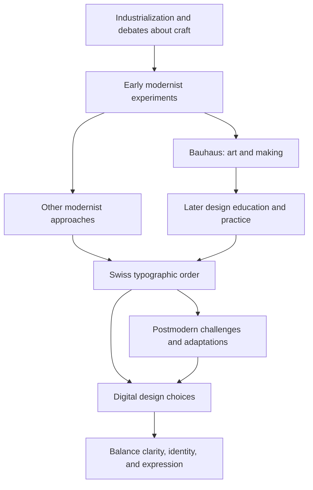

# Chapter 3: Modernism, Postmodernism, and Visual Language

[Book contents](README.md) · [Next: The white T-shirt case study](04-white-tshirt-case-study.md)

Before you read a headline, its size, position, and surroundings already suggest how to approach it. A tidy table invites comparison. Overlapping letters might invite exploration—or simply make you give up. **Visual language is the system of choices through which a design communicates:** typography, spacing, composition, color, and imagery.

The history below follows one influential path through European design. It is not a complete world history or a sequence in which each new movement made the previous one disappear.

## A Short Path Into Modernism

Industrial production raised questions about how objects should be made and what good design should serve. In the nineteenth century, Arts and Crafts advocates challenged damaging aspects of industrialization and valued the relationship between making and everyday life. Their responses helped prepare ground for later design debates. [V&A: Arts and Crafts](https://www.vam.ac.uk/articles/arts-and-crafts-an-introduction).

Early twentieth-century modernism developed as a broad set of efforts to rethink art, design, and society. Many modernists saw new materials and industrial methods as opportunities to improve ordinary life. Reduction and function were connected to social ambitions, not merely a preference for empty white pages. Modernism contained different movements and disagreements. [V&A: What was Modernism?](https://www.vam.ac.uk/articles/what-was-modernism).

## Bauhaus: Learning Across Art and Making

Walter Gropius founded the Bauhaus in Weimar in 1919. The school connected art and design education through foundational study and workshops, including work with materials, color, and form. Its early emphasis on craft later developed toward designing for industrial production. The school closed in 1933, but its teachers and ideas continued to influence design education elsewhere. [The Met: The Bauhaus, 1919–1933](https://www.metmuseum.org/essays/the-bauhaus-1919-1933).

The useful lesson is an approach to learning: investigate materials and relationships, then connect them to a purpose. A few geometric shapes in primary colors do not, by themselves, reproduce that approach.

## Swiss / International Typographic Style

Swiss graphic design after the Second World War developed a particularly influential language of order. The International Typographic Style emphasized grids, precise composition, sans-serif typography, photography, and restrained decoration. The Swiss National Library describes its ordered structure and visual clarity in [The International style 1950–1970](https://www.nb.admin.ch/en/the-international-style-1950-1970).

Five practical ideas help you read or build a page:

- **Grid:** align elements along a shared structure.
- **Hierarchy:** make relationships and reading priority visible.
- **Clarity:** help readers identify information and actions.
- **Reduction:** remove elements that do not serve the purpose.
- **Function:** judge choices by what the design needs to enable.

For example, a shirt page can place its name, photograph, measurements, and price in predictable locations. A grid creates relationships; it need not make every element the same size or produce a symmetrical layout.

## Postmodernism: Whose Rules Are These?

Postmodern design challenged the idea that a single orderly language could serve every context. It explored plurality, irony, historical quotation, and stylistic mixtures, especially during the 1970s and 1980s. “Quotation” here can mean borrowing a recognizable visual convention, such as the look of an old advertisement. [V&A: What is Postmodernism?](https://www.vam.ac.uk/articles/what-is-postmodernism).

In graphic design, challenges to strict typographic rules opened room for expressive lettering, fragmentation, and playful composition. The Swiss National Library discusses both departures from the International Style and adaptations of it in [Postmodern posters, 1970 to today](https://www.nb.admin.ch/en/postmodern-posters-1970-to-today).

Disruption is a choice with consequences. A tilted headline may communicate energy. A tilted, overlapping set of payment instructions may prevent someone from completing a task. Expression still needs an audience that can interpret it.

## Compare the Priorities

These are tendencies for analysis, not definitions that every historical design obeys.

| Tension | Modernist emphasis | Postmodern response | Question for a designer |
| --- | --- | --- | --- |
| Order / disruption | Predictable relationships | Interrupt expectations | Where should attention pause? |
| Universality / identity | A shared visual system | Local or specific voices | Whose conventions seem normal here? |
| Clarity / expression | Direct reading | Meaning through personality | What must remain immediately readable? |
| Grid / anti-grid | Stable alignment | Break or expose the structure | Is the disruption intentional? |
| Restraint / abundance | Reduce competing elements | Layer references and details | Does richness reward or overwhelm? |
| Function / irony | Present purpose directly | Play with purpose and expectation | Will the audience understand the joke? |

The arrows show selected relationships, not a claim that one school single-handedly invented the next movement.

## The Tension on a Screen

Consider these proposed digital designs, rather than claims about particular commercial products. A course registration form benefits from consistent labels, spacing, and error messages. A music-event page might use collage and oversized type to express a scene's identity. The same event site can use expressive artwork above a clearly structured ticket form.

Visual simplicity does not guarantee usability: tiny gray text can be both minimal and unreadable. Abundance does not guarantee confusion: strong hierarchy can make a rich page navigable. Test text readability, keyboard access, mobile layout, and the visibility of essential information.

For the identical white T-shirt, a modernist presentation might show one front-facing photograph, aligned specifications, and a short headline. A postmodern presentation might place the same photograph in a collage with an ironic headline and contrasting type. One invites calm evaluation; the other invites interpretation. These are intended effects to test, not guaranteed audience responses.

## How to Read a Design

1. Describe what you see before naming a style: large type, aligned edges, layered images.
2. Trace your attention: what appeared first, second, and last?
3. Ask what the choices imply about the product and audience.
4. Identify what is easy or difficult to read and use.
5. Compare your interpretation with the date, purpose, and documented context.

## Museum Research

**Suggestions for external research:** Use museum or institutional collection searches, then open actual object records. Try the following starting points; these are search terms, not assertions that every institution owns a matching object.

| Institution | Suggested search terms | What to investigate |
| --- | --- | --- |
| The Metropolitan Museum of Art | Bauhaus typography | Relationships between letters, images, and space |
| MoMA | Swiss graphic design poster | Alignment and reading sequence |
| Cooper Hewitt | experimental typography poster | How type communicates beyond its words |
| V&A | postmodern graphic design | Historical references and visual mixtures |
| Bauhaus archives | preliminary course materials | Connections between teaching and form |

Record the actual title, maker, date, medium, collection identifier, and object-record URL. Mark missing information as unknown. Check image-use terms before reproducing an image. Distinguish what the museum documents from your own visual interpretation.

## What You Should Remember

Design traditions carry ideas about order, function, identity, and expression. Modernist and postmodern approaches remain useful points of comparison. Choose visual techniques for a purpose, check their effects with readers, and support historical claims with real sources.
