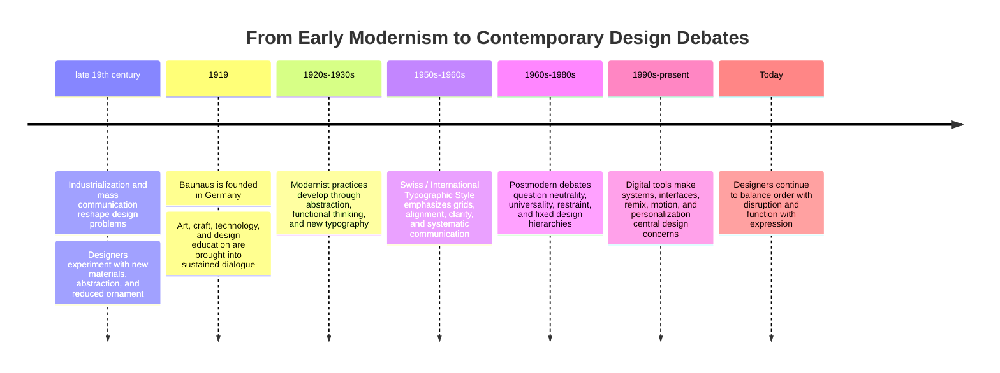

# Chapter 3: Design Language and Visual Ideas

Visual design is not decoration added after an idea. It is one of the ways an idea becomes visible, legible, memorable, and believable. A typeface can suggest authority or play. A grid can make information feel orderly. A crowded composition can suggest energy, urgency, or abundance. Even a nearly empty page makes a claim about what deserves attention.

A **design language** is a recurring system of choices: typography, color, spacing, images, materials, shapes, movement, and rules for arranging them. Design languages carry cultural memories. A strict grid may recall modernist clarity. A deliberately awkward collage may suggest postmodern quotation or skepticism toward visual rules. These associations are not automatic or universal, but they give designers a vocabulary for thinking about how form carries ideas.

## A Short History of Modernist Design

Modernism was not one single style with one founder. It was a broad set of experiments, arguments, and movements that developed across the late nineteenth and twentieth centuries. Industrial production, new technologies, urban life, changing politics, and the growth of mass communication all encouraged designers to reconsider older decorative conventions.

Many early modernist designers wanted form to respond to modern conditions. They explored geometric shapes, abstraction, new materials, photography, asymmetry, and typography that could communicate efficiently. Some argued that design should be grounded in use and construction rather than imitate historical ornament. Others saw abstraction as a way to develop a visual language that could travel across borders.

The word **function** in this history does not mean that design should be boring. It means that form should have a relationship to purpose, use, material, and communication. A chair, poster, building, or page can be expressive while still making its intended use understandable.

### Bauhaus

The Bauhaus school, founded in Germany in 1919, brought together art, craft, architecture, and design education. Its teaching emphasized experimentation with materials, making, form, and the relationship between objects and everyday life. The school changed over time and included different teachers and approaches, so it should not be reduced to a single visual formula.

The Bauhaus is useful to study because it treated design as both practical work and cultural thinking. Students investigated color, shape, material, space, and production. The school also helped establish an influential model of interdisciplinary design education. Its history includes difficult political circumstances and the effects of modern institutions, industry, and migration; it is not simply a story of a style becoming popular.

### Swiss / International Typographic Style

In the 1950s and 1960s, designers associated with the Swiss or International Typographic Style developed a disciplined approach to graphic communication. Common features included modular grids, sans-serif type, asymmetrical layouts, strong alignment, limited visual elements, and a preference for clarity. Photography and typography were often organized so that information could be scanned and compared.

The word **international** points to an aspiration: a visual language that could communicate across national and linguistic boundaries. But no design is truly outside culture. Typeface choices, reading habits, institutional authority, and ideas about neutrality all come from particular histories. The style's claim to universality is therefore something to examine, not simply accept.

## Postmodernism as a Reaction and Expansion

Postmodern design developed in part as a reaction against the certainty, restraint, universality, and order associated with some modernist practices. Designers and theorists questioned whether one rational system could represent everyone, whether clarity was always the highest value, and whether supposedly neutral forms concealed cultural or institutional power.

Postmodern approaches often welcomed plurality, quotation, irony, historical references, expressive typography, layered meanings, and visible contradiction. A design might deliberately mix styles, interrupt a grid, expose its own construction, or use decoration as an argument rather than treating it as waste.

Postmodernism was not simply the opposite of modernism, and not every colorful or irregular design is postmodern. It is better understood as a field of debates about authority, originality, history, identity, taste, and communication. A postmodern composition can still use a grid. A modernist composition can still be expressive. Designers often borrow, combine, and revise these positions.

## The Continuing Tensions

The history becomes most useful when treated as a set of questions rather than a timeline with a winner.

| Tension | One side emphasizes | The other side emphasizes | Contemporary design question |
| --- | --- | --- | --- |
| Order and disruption | Predictability, hierarchy, and calm | Surprise, interruption, and critique | When should an interface stabilize attention, and when should it interrupt a habit? |
| Universality and identity | Shared rules and broad legibility | Situated voices, difference, and belonging | Who is treated as the default user? |
| Clarity and expression | Fast understanding and low friction | Mood, ambiguity, and personal interpretation | Does expressive form help the message, or hide it? |
| Grid and anti-grid | Alignment, rhythm, and comparison | Layering, collision, and movement | Which content needs structure, and which benefits from tension? |
| Restraint and abundance | Selectivity, focus, and economy | Richness, accumulation, and sensory density | Is less helping people think, or merely signaling seriousness? |
| Function and irony | Direct use and transparent purpose | Commentary, play, and skepticism | Can a design be useful while also questioning its own conventions? |

These tensions appear in ordinary digital products. A banking app may use a strict grid and clear hierarchy because users need to find balances and complete tasks with confidence. An editorial website may break the grid for a feature story to express a particular voice. A shopping site may use restrained product photography in one area and abundant user-generated images in another. A mobile app can provide a calm default flow while using animation or playful language to create personality.

Contemporary design has not chosen one final style. Product teams still negotiate between consistency and individuality, accessibility and novelty, efficiency and atmosphere, system rules and cultural specificity. A design system may create order while allowing teams to express different identities. A page may be technically functional but still communicate a political or cultural position through whose images it includes and whose needs it anticipates.

## A Design Language Timeline

The timeline below is a simplified map, not a claim that movements began or ended on exact dates everywhere.

The point of the timeline is not to memorize a list of dates. It is to notice that visual choices answer historical problems. When production, media, politics, and technology change, designers ask what communication should look like. Later designers can accept, reject, quote, or remix earlier answers.

## The White T-Shirt Through Two Design Languages

Return to the same plain white T-shirt. The shirt itself has not changed: same cut, fabric, color, and construction. The presentation changes the product's perceived character.

### A Modernist Presentation

The shirt is photographed frontally against a plain background. A consistent grid aligns the product image, measurements, material information, and price. Typography is restrained, spacing is generous, and the page removes distractions. The message is that the shirt is clear, useful, rational, and easy to compare.

This presentation might make the shirt feel like a precisely designed basic: dependable, universal, and ready to fit many lives. Its strength is legibility. Its risk is pretending that “neutral” presentation has no cultural viewpoint or that one version of simplicity works equally well for everyone.

### A Postmodern Presentation

The same shirt is shown through overlapping images, unexpected scale changes, mixed type styles, and references to different fashion or media conventions. The copy may question the idea of a “basic” garment. A label, annotation, or deliberate visual contradiction could draw attention to how the product is being framed.

This presentation might make the shirt feel like a commentary on taste, identity, and the commercial language of basics. Its strength is expression and self-awareness. Its risk is that irony, clutter, or visual experimentation can make price, fit, care, or accessibility harder to understand.

Neither presentation is automatically better. The appropriate choice depends on the audience, the task, the stakes, and the experience the designer wants to create. A useful product page may borrow modernist clarity for specifications and postmodern expression for an editorial introduction. Design languages can be combined deliberately.

## How to Read a Design

When you encounter a poster, package, website, interface, or object, slow down before deciding whether you like it. Ask what the design is doing.

1. **Start with attention**: What do you notice first? What is large, bright, moving, isolated, or repeated?
2. **Trace hierarchy**: What do you see second and third? How do size, contrast, alignment, and spacing guide your path?
3. **Identify the system**: Is there a visible grid, rhythm, pattern, or set of repeated components? Where does the design follow or break that system?
4. **Study typography**: What do the type choices suggest about authority, speed, intimacy, seriousness, history, or play? How does the text actually read at its intended size?
5. **Look for absences**: Who or what is missing? What information is difficult to find? What kind of user seems to be assumed?
6. **Separate fact from signal**: Which parts communicate product information, and which parts create mood or status?
7. **Ask about context**: Where was this made, for whom, when, and under what technical or institutional conditions?
8. **Test the result**: Does the visual language improve understanding and use, or does it mainly make an impression?

Try this method with the white T-shirt. A grid and measurement chart may signal comparability and control. A torn headline or collage may signal critique and individuality. Neither signal proves quality. Look for the actual fabric, fit, construction, price, and care information too.

## Museum Research

Museum and institutional collections are valuable because they let you study authentic objects, records, and historical context instead of relying on a vague image search. Start with collection databases or exhibition pages from institutions such as The Metropolitan Museum of Art, MoMA, Cooper Hewitt, the V&A, Bauhaus archives, libraries, design museums, or other credible collections.

Use search terms such as:

- early modernist graphic design collection
- Bauhaus typography poster collection
- Bauhaus preliminary course design education
- Swiss International Typographic Style grid typography
- modernist sans serif poster collection
- postmodern graphic design expressive typography
- design history grid and anti-grid
- museum collection product design modernism

Search within the institution's own collection or research pages when possible. Do not assume that an image appearing in a search result is an authentic object, that its date is correct, or that its designer is identified accurately. Verify the title, maker or studio, date, medium, collection record, and institutional description yourself.

For a short research note, record what you can verify and distinguish it from your interpretation. You might write: “The collection record identifies the object as a printed poster from a particular period and gives its maker and medium. I interpret the alignment and type hierarchy as evidence of a systematic approach because...” Do not invent an object, quotation, accession number, or URL when the record does not provide one.

## What You Should Remember

Visual design carries ideas through systems of type, image, space, color, material, and hierarchy. Modernist traditions often explored function, reduction, grids, and clarity; Bauhaus connected art, craft, technology, and education; Swiss design pursued systematic communication and legibility. Postmodern approaches questioned certainty and universality through plurality, quotation, irony, disruption, and expression. These are continuing tensions, not styles that replaced one another forever. The same white T-shirt can feel universal and precise or expressive and self-aware depending on its design language, while its actual qualities remain the evidence that matters.
