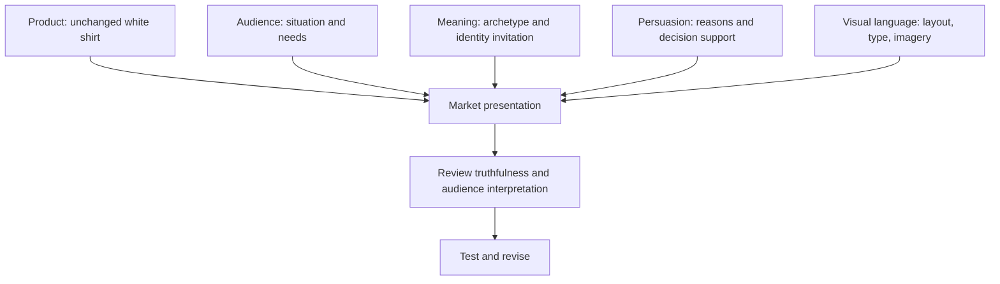

# Chapter 4: One Shirt, Four Different Invitations

[Book contents](README.md) · [Next: Directing AI and reviewing its work](05-synthesis.md)

Put an ordinary, high-quality plain white T-shirt on a table. Now give four creative teams the same assignment: make a presentation that gives someone a reason to consider it. One team finds an unfamiliar street. Another reaches for a ruler. A third starts making a collage. The fourth invites friends over.

They have not designed four shirts. They have designed four interpretations.

## The Product Stays Fixed

Everything in this case study is imaginary. The campaign names, headlines, stories, and scenes below are original classroom concepts. “High-quality” is an exercise assumption, not a verified claim about a real manufacturer.

Across all four concepts, keep the shirt's fabric, construction, white color, fit, sizes, and quality unchanged. Keep its price, stock availability, and purchase terms identical, too, so that we can concentrate on presentation. No concept adds printing, technical performance, certifications, or a charitable donation. Real product specifications would need verification before publication.

## 1. The Detour — Explorer

**Audience:** People who want to explore nearby places during their free time, without treating adventure as an expensive expedition.

**Brand archetype:** Explorer, emphasizing curiosity and independence.

**Headline:** Take the unfamiliar turn.

**Short product story:** Your afternoon does not need a detailed itinerary. Start with the white shirt already on your chair, leave room for a change of plan, and see what is around the next corner. The interesting part is where you decide to go.

**Persuasive principles:** Framing connects an ordinary purchase to everyday exploration. A voluntary “plan a local walk” activity could support commitment and consistency, provided participation does not require purchasing anything.

**Visual language:** An open editorial layout, a large environmental photograph, restrained navigation, and a clear block of product information. The composition suggests space to explore without hiding the details.

**Likely imagery:** Someone wearing the unchanged shirt while looking at a neighborhood map or browsing a street market. Use ordinary settings, not a summit photograph that suggests technical outdoor performance.

**Meaning offered:** Permission to be curious on your own terms.

**Ethical risk or limitation:** The story could imply that buying clothing is a prerequisite for adventure. Make clear that the activity is available without the purchase. Do not claim sun protection, moisture management, or durability beyond the available evidence.

## 2. The Clear Choice — Sage

**Audience:** People comparing everyday wardrobe basics who want useful information without a long sales pitch.

**Brand archetype:** Sage, with understanding as the central promise.

**Headline:** Start with the details.

**Short product story:** Here is a white T-shirt. Look at its shape, check the measurements, and compare it with one you already like. If it fits your needs, it can earn a place in your wardrobe. If it does not, the information has still done its job.

**Persuasive principles:** Logos supports comparison through verified facts. An authority appeal would be appropriate only if a relevant, identified expert actually contributes evidence; a lab-style graphic alone is no proof.

**Visual language:** Restrained modernist / Swiss-influenced design: a clear grid, sans-serif type, strong hierarchy, ample spacing, black text, and limited accent color.

**Likely imagery:** Front and back views at a consistent scale, plus an accurate detail photograph. Include a measurement diagram only when its numbers are available and checked.

**Meaning offered:** Confidence in making a considered choice.

**Ethical risk or limitation:** Precise typography can make weak claims look scientific. Explain the basis of comparisons and leave unknown facts unresolved. A clean page should not conceal uncomfortable information.

## 3. The Unbranded Statement — Rebel

**Audience:** People who enjoy questioning fashion expectations and experimenting with how they present themselves.

**Brand archetype:** Rebel, focused on resisting prescribed identity.

**Headline:** No logo. Your say.

**Short product story:** The shirt does not arrive with a slogan across your chest. Wear it with the things you already love, or pair it with something that should not work and see what happens. You get to decide what the outfit says.

**Persuasive principles:** Framing presents plainness as a deliberate choice. Pathos invites the feeling of self-direction. There is no need to manufacture a movement or claim that everyone interesting already owns it.

**Visual language:** Disruptive, postmodern collage: contrasting typefaces, offset panels, oversized words, and playful visual quotation. Keep the actual shirt photograph and essential buying information legible.

**Likely imagery:** The unchanged shirt surrounded by removable paper cutouts and different accessories. The collage belongs to the advertisement, not to the shirt being sold.

**Meaning offered:** Freedom to interpret your own appearance.

**Ethical risk or limitation:** Selling rebellion can become another demand to conform. Avoid mocking other people's clothing or suggesting that a purchase proves independence. Explain clearly that the graphic treatments are not printed on the product.

## 4. The Everyday Seat — Everyperson

**Audience:** People looking for an uncomplicated casual staple and a presentation that does not ask them to perform status.

**Brand archetype:** Everyperson, emphasizing ordinary connection.

**Headline:** A place in your everyday.

**Short product story:** Some days are a shared lunch, a library visit, and the trip home. A white T-shirt can be part of that ordinary mix. You do not need a dramatic occasion to wear something you like.

**Persuasive principles:** Liking may grow from a friendly, recognizable voice. Social proof could come from authentic customer accounts, if available; this imagined campaign includes none because we have no real customer evidence.

**Visual language:** Warm, straightforward editorial design, readable type, consistent spacing, and relaxed photographs. Familiarity comes from the scenes and tone, not from making the page careless.

**Likely imagery:** People in everyday settings wearing the same shirt model. Use accurate fit representation, consent, and appropriate labeling for staged or generated scenes; an advertisement is not a customer testimonial.

**Meaning offered:** Comfort with being part of ordinary life.

**Ethical risk or limitation:** Belonging can turn into pressure to fit in. Avoid claims that the shirt suits every body or that ownership wins friendship. The audience should see a possibility, not a membership requirement.

## Compare the Four Presentations

| Concept | Audience priority | Archetype | Persuasive emphasis | Visual language | Meaning | Main risk |
| --- | --- | --- | --- | --- | --- | --- |
| The Detour | Curiosity | Explorer | Framing; voluntary commitment | Open editorial space | Independence | Implying unsupported performance |
| The Clear Choice | Understanding | Sage | Reasons and evidence | Swiss-influenced grid | Informed confidence | Making weak evidence look authoritative |
| The Unbranded Statement | Self-direction | Rebel | Framing and emotion | Postmodern collage | Personal expression | Selling conformity as rebellion |
| The Everyday Seat | Familiarity | Everyperson | Liking; genuine reviews if available | Warm editorial structure | Connection | Making belonging conditional |

The comparisons apply the concepts from [Chapter 1](01-persuasion.md), [Chapter 2](02-archetypes.md), and [Chapter 3](03-design-language.md). They are creative hypotheses, not measured findings about which advertisement will sell more shirts.

## A Small Classroom Test

Give classmates the four headlines and presentation descriptions without the archetype labels. Ask what each suggests about the shirt, what facts they still need, and which presentation they prefer. If someone assumes the Explorer shirt is stronger or the Sage shirt is cheaper, investigate which cue created that inference.

Keep the same factual product block and price in every version. Changing several product facts at once would make it harder to interpret the comparison. A few classmates can reveal misunderstandings; they cannot establish what an entire market will buy.

## What You Should Remember

A product's presentation combines audience, meaning, persuasion, and visual language. The same shirt can support different stories, but a new story cannot supply missing product evidence. Test what people infer as carefully as what you explicitly say.
