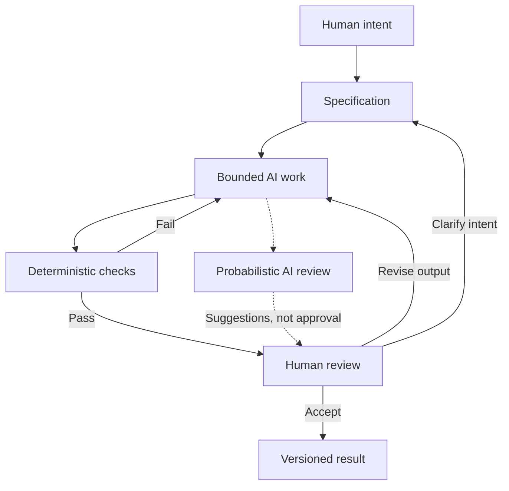

# Chapter 5: From Creative Intent to Work You Can Review

[Book contents](README.md) · [Previous: The white T-shirt case study](04-white-tshirt-case-study.md)

“Make this more compelling” gives an AI assistant little direction. Compelling to whom? For what purpose? With what evidence? The previous chapters give you a vocabulary for answering those questions before generating more material.

## Three Lenses, One Brief

| Lens | Core question | Example direction for the shirt |
| --- | --- | --- |
| Persuasion | What response are we trying to enable? | Help someone compare the shirt with what they need |
| Archetype | What meaning or identity are we expressing? | Sage: confidence through understanding |
| Design language | How should that meaning look and feel? | A restrained grid with readable specifications |

The lenses should reinforce each other. A Sage brief that asks for fake urgency and unreadable decorative text contains a conflict. Giving the AI a more detailed version of that conflict does not resolve it; a person must decide what matters.

This approach works beyond advertising. For a campus event page, the response might be understanding whether to attend; the meaning might be welcome; the design might combine lively artwork with clear time and location information. The design serves a decision in a particular situation.

## Bound the Work With a Specification

A **specification** states what should be produced, what it must contain, what it must preserve, and how it will be checked. It gives both the assistant and the reviewer a boundary.

Here is a sample classroom prompt. Its filename is a proposed output for a separate exercise, not another required file in this book.

```text
Create one Markdown campaign brief in shirt-brief.md.
Audience: students comparing everyday wardrobe basics.
Response: help readers decide whether to investigate the shirt further.
Meaning: Sage; emphasize understanding rather than prestige.
Visual direction: Swiss-influenced grid, clear hierarchy, readable details.
Product: the same imaginary plain white T-shirt in every concept.
Include: headline, 60–90-word story, imagery direction, and ethical risk.
Do not invent reviews, prices, measurements, certifications, or stock limits.
Label missing product facts as unknown. Edit only the requested file.
Check the required sections and story length before reporting completion.
```

“Sage” alone is vague. The audience, response, evidence limits, format, and visual direction make the task reviewable. A bounded task also makes a mistake easier to locate and correct.

## Different Checks Answer Different Questions

**Deterministic checks** apply explicit rules repeatably. With the same input and environment, they return the same result. A script can check whether required files exist, count headings, detect broken relative links, or ask a Mermaid parser whether a diagram is valid.

**Probabilistic review** uses AI to interpret the work. It can suggest that a tone feels exclusionary, identify possible contradictions, or flag a historical claim for checking. Its answers may vary, and a confident explanation may still be wrong. An AI saying “the links look fine” is not equivalent to a link-checking program opening those paths.

**Human judgment** addresses purpose, truthfulness, context, meaning, and final decisions. A person must evaluate evidence and consequences, including disagreements between automated results and what readers experience.

| Question | Best starting point | Important limit |
| --- | --- | --- |
| Are all required files present? | Deterministic file check | An empty argument can fill a nonempty file |
| Does the diagram parse? | Mermaid parser | Valid syntax does not guarantee a useful diagram |
| Does the story contradict the brief? | AI review plus comparison with the specification | AI can miss or invent contradictions |
| Is a quoted source real and relevant? | A person opening and checking the source | A working URL alone proves little |
| Is the invitation fair and appropriate? | Human review with audience feedback | One person's taste is not the whole audience |

For this repository, the existing GitHub workflow checks that the six required book files are nonempty. It also reports issue references in commit history and the number of Mermaid code blocks. Those checks establish useful structure; they do not grade historical accuracy, parse Mermaid, or decide whether the prose teaches well. You can inspect the actual rules in [the practical check workflow](../.github/workflows/grade.yml).

## Human Review as a Pit Stop

Think of a race car. Continuous motion matters, but the team deliberately stops to inspect, adjust, and decide whether it is ready to continue. Reviewing AI work benefits from similar planned moments.

Inspect the specification before generation, the first complete draft before committing, and the result before publishing or merging. At each pit stop, focus on the next decision: Is the scope right? Are claims supported? Does the reader understand? Has a revision introduced a new problem?

Automation can keep handling routine checks. A scheduled inspection prevents its speed from turning a small misunderstanding into a polished, widely shared mistake.



The optional AI review informs the person. It does not replace the human acceptance decision.

## Why Version Control Matters

AI can generate a lot of text quickly. Git lets you inspect what changed rather than relying on memory. A **branch** separates a line of work; a **diff** shows changes; a **commit** records a snapshot with a message. A **push** sends local commits to a remote repository. A **merge** combines branch histories. Pushing a branch does not itself merge it into `main`.

Before accepting a chapter, inspect its diff and compare it with the issue's requirements. Commit a coherent change with a message that references the actual issue number. Do not invent issue numbers or add unrelated files just to make the working tree look clean.

The practical's standard learning loop is **issue → branch → bounded work → review → commit → push → merge → verify**. Follow your assigned workflow and keep the review stage meaningful.

Git provides traceability and recovery, but only for work that has been recorded. A later correction can be committed, and a previous committed change can be reversed with a new commit when appropriate. Git does not establish that a claim is true, save uncommitted work automatically, or turn AI-generated prose into reviewed prose.

## Try the Complete Loop

Choose one campaign from Chapter 4. Write a bounded revision brief, change one feature such as the headline, and inspect the diff. Run the relevant structural checks. Then ask a reader whether the intended meaning is clearer. Record what you accepted and why in the commit message or associated review. A small, explainable improvement is more useful than an unexplained rewrite.

## Questions for Next Week

- Which passage would you rewrite in your own voice, and why?
- Which claim have you checked against its original source?
- What did a classmate infer that you did not intend?
- Which automated check would catch a realistic mistake here?
- Where did AI feedback help, and where did you disagree?
- Can you identify a specific commit and explain its purpose?

## What You Should Remember

Persuasion defines the response, archetypes organize meaning, and visual language guides presentation. Specifications bound AI work. Deterministic checks catch explicit failures, AI review offers fallible suggestions, humans make editorial decisions, and Git records the changes you choose to keep.
